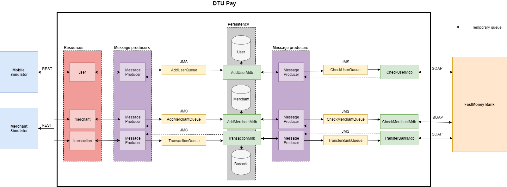

# 02267-SoftwareDevelopmentOfWebServices
This is the code base from the group Kolkata in course 02267 Software Development of Web Services cloned into new Git repo for further
changes. The reason for not making the changes in the original git repository is that the course has finished and I (frksteenhoff) wanted to further improve the logic for personal development reasons. 

Original git repository is found here: https://repos.gbar.dtu.dk/git/s123807/Kolkata.git

## Architecture overview

## Installation Guide
*This is a short overview, not the full description of how to get the project running*

* Jenkins
 * Install andon plugin
 * Create one view for each of the folders above except `Documentation`.
* Wildfly
  * Create queues
  * Create connection factory
